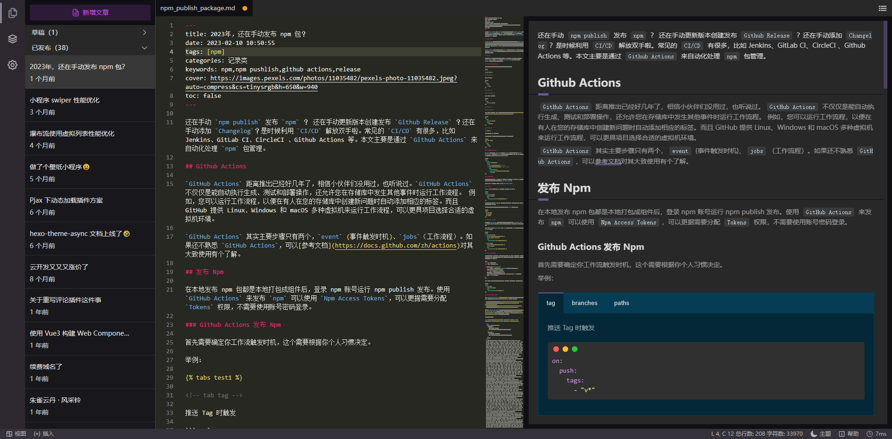

<h1 align="center">hexo-editor</h1>

  
  
  

    在线 Hexo 写作编辑器。

## 截图 | Screenshots

  

## 功能 | Feature

- [x] 文章增删改和预览
- [x] 发布草稿、下架发布
- [x] Markdown 编辑、预览、格式化
- [x] front-matters 编辑
- [x] 图片粘贴、Markdown 语法提示、解析 HTML
- [x] 主题切换
- [x] 静态资源管理
- [x] 命令面板
- [ ] 搜索文章内容
- [ ] 支持图床
- [ ] Markdown 同步滚动
- [ ] 使用 Github 仓库
- [ ] 更多

## 贡献 | Contribute

欢迎各种各样的 PR（魔改也是可以的！）

All kinds of PR are welcomed, including crazy change!

如果这项目帮到你了，点个爱的五角星呗~

If this project helped you a bit, please leave a ⭐ with your ❤ :p!
